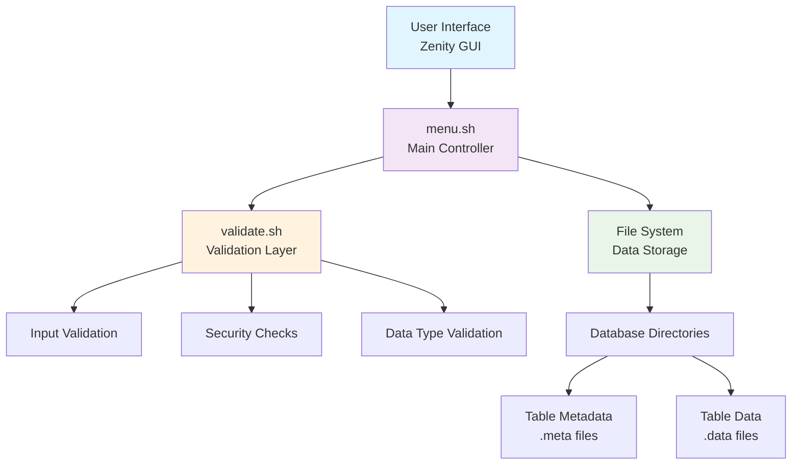

# 🗄️ DBMS in Bash

A lightweight Database Management System implemented entirely in Bash scripting with a user-friendly GUI interface using Zenity.

[](https://opensource.org/licenses/MIT)
[](https://www.gnu.org/software/bash/)
[](https://help.gnome.org/users/zenity/stable/)

---

## 📋 Table of Contents

- [Overview](#-overview)
- [Features](#-features)
- [Prerequisites](#-prerequisites)
- [Installation](#-installation)
- [Quick Start](#-quick-start)
- [Project Structure](#-project-structure)
- [System Architecture](#-system-architecture)
- [Usage Guide](#-usage-guide)
- [Data Storage Format](#-data-storage-format)
- [Validation & Security](#-validation--security)
- [Testing](#-testing)
- [Contributing](#-contributing)
- [License](#-license)

---

## 🎯 Overview

**DBMS in Bash** is a fully functional database management system built using shell scripting and Zenity for the graphical interface. This project demonstrates how fundamental database operations can be implemented using basic Unix tools and shell scripting techniques.

### 🎪 Why This Project?

- **Educational Purpose**: Perfect for learning database concepts and bash scripting
- **Lightweight**: No heavy database installations required
- **Cross-Platform**: Works on any Unix-like system with bash and zenity
- **Self-Contained**: All data stored in simple text files
- **GUI-Driven**: User-friendly interface for non-technical users

---

## ✨ Features

### 🗃️ Database Operations
- ✅ Create new databases
- ✅ List all existing databases
- ✅ Connect to databases
- ✅ Drop databases with confirmation
- ✅ Input validation and error handling

### 📊 Table Management
- ✅ Create tables with custom columns
- ✅ Define column types (Integer, String)
- ✅ Set primary keys
- ✅ List all tables in a database
- ✅ Drop tables with confirmation

### 📝 Data Operations
- ✅ Insert records with validation
- ✅ View table data in formatted display
- ✅ Update existing records
- ✅ Delete records with confirmation
- ✅ Primary key constraint enforcement
- ✅ Data type validation

### 🛡️ Security & Validation
- ✅ Input sanitization
- ✅ Reserved keyword protection
- ✅ File system injection prevention
- ✅ Duplicate prevention
- ✅ Data integrity checks

---

## 🔧 Prerequisites

### System Requirements
- **Operating System**: Linux, macOS, or Unix-like system
- **Shell**: Bash 4.0 or higher
- **GUI Library**: Zenity (for graphical interface)

### Check Your System
```bash
# Check Bash version
bash --version

# Check if Zenity is installed
which zenity
```

---

## 🛠️ Installation

### 1. Install Zenity

**Ubuntu/Debian:**
```bash
sudo apt update
sudo apt install -y zenity
```

**CentOS/RHEL/Fedora:**
```bash
sudo yum install zenity
# or for newer versions
sudo dnf install zenity
```

**macOS:**
```bash
brew install zenity
```

### 2. Clone the Repository
```bash
git clone https://github.com/yourusername/DBMS_IN_BASH.git
cd DBMS_IN_BASH
```

### 3. Make Scripts Executable
```bash
chmod +x *.sh
```

---

## 🚀 Quick Start

### Launch the Application
```bash
./menu.sh
```

### Create Your First Database
1. Select **"Create Database"**
2. Enter a database name (e.g., `company_db`)
3. Click **OK**

### Create Your First Table
1. Select **"Connect to Database"**
2. Choose your database
3. Select **"Create Table"**
4. Follow the prompts to define columns and primary key

### Insert Data
1. From the database menu, select **"Insert into Table"**
2. Choose your table
3. Fill in the data fields
4. Click **OK**

---

## 📁 Project Structure

```
DBMS_IN_BASH/
├── 📄 menu.sh              # Main entry point - launches the application
├── 📄 validate.sh          # Input validation and security functions
├── 📄 README.md            # Project documentation
├── 📄 test_cases.md        # Comprehensive testing guide
└── 📁 dbms/                # Data directory (created automatically)
    ├── 📁 database1/       # Individual database directory
    │   ├── 📄 table1.meta  # Table structure definition
    │   ├── 📄 table1.data  # Table data storage
    │   ├── 📄 table2.meta
    │   └── 📄 table2.data
    └── 📁 database2/
        └── ...
```

### 📄 File Descriptions

| File | Purpose | Key Functions |
|------|---------|---------------|
| `menu.sh` | Main application controller | GUI menus, database operations, table management |
| `validate.sh` | Security and validation layer | Input sanitization, reserved word checking, data validation |
| `*.meta` | Table structure files | Column definitions, data types, primary key info |
| `*.data` | Table data files | Actual record storage in colon-separated format |

---

## 🏗️ System Architecture



### 🔄 Workflow Overview

1. **User Interaction**: Zenity provides intuitive dialog boxes
2. **Input Processing**: All inputs pass through validation layer
3. **Business Logic**: Main controller handles database operations
4. **Data Persistence**: Information stored in structured text files
5. **Feedback Loop**: Results displayed back to user via GUI

---

## 📖 Usage Guide

### 🗃️ Database Operations

#### Creating a Database
- Database names must start with a letter or underscore
- Can contain letters, numbers, and underscores
- Maximum length: 64 characters
- Case-insensitive (TestDB = testdb)

#### Connecting to a Database
- Select from list of available databases
- Opens database-specific menu with table operations

### 📊 Table Operations

#### Creating Tables
- Table names follow same rules as database names
- Support 1-15 columns per table
- Column types: `int` (integer) or `string` (text)
- One column must be designated as primary key

#### Data Types
- **Integer (`int`)**: Whole numbers only, validated on input
- **String (`string`)**: Text data, any characters allowed

### 📝 Data Management

#### Inserting Data
- Primary key field cannot be empty
- Integer fields validated for numeric input
- Duplicate primary keys rejected
- Data stored in colon-separated format

#### Viewing Data
- Tables displayed in formatted columns
- Headers show column names and types
- Empty tables show structure only

---

## 💾 Data Storage Format

### 📄 Metadata Files (.meta)
```
column_name:data_type:primary_key_flag
id:int:PK
name:string:
email:string:
age:int:
```

### 📄 Data Files (.data)
```
value1:value2:value3:value4
1:John Doe:john@email.com:25
2:Jane Smith:jane@email.com:30
```

### 🔍 File Organization
- Each database = one directory
- Each table = two files (.meta + .data)
- Human-readable text format
- Easy to backup and migrate

---

## 🛡️ Validation & Security

### 🔒 Input Sanitization
- **Path Traversal Protection**: Prevents `../` attacks
- **Special Character Filtering**: Blocks dangerous characters
- **Reserved Word Checking**: Prevents SQL keyword conflicts
- **Length Validation**: Enforces reasonable limits

### 🚫 Reserved Keywords
The system blocks these reserved words:
```
select, insert, update, delete, drop, create, table, 
database, from, where, int, string, null, pk, system, default
```

### ✅ Data Validation
- **Primary Key Enforcement**: No duplicates allowed
- **Type Checking**: Integer fields accept numbers only
- **Required Field Validation**: Primary keys cannot be empty
- **Format Validation**: Ensures data integrity

---

## 🧪 Testing

### Run Comprehensive Tests
```bash
# Follow the test cases in test_cases.md
# Test basic functionality first
./menu.sh

# Test edge cases and security
# See test_cases.md for detailed scenarios
```

### 🎯 Key Test Areas
- ✅ Input validation and sanitization
- ✅ File operations and data integrity
- ✅ GUI navigation and user experience
- ✅ Error handling and recovery
- ✅ Security and injection prevention

For detailed testing procedures, see [`test_cases.md`](test_cases.md).

---

## 🤝 Contributing

We welcome contributions! Here's how you can help:

### 🐛 Bug Reports
- Use GitHub Issues to report bugs
- Include steps to reproduce
- Provide system information

### 💡 Feature Requests
- Suggest new features via GitHub Issues
- Explain the use case and benefits
- Consider backward compatibility

### 🔧 Development
1. Fork the repository
2. Create a feature branch
3. Make your changes
4. Test thoroughly
5. Submit a pull request

### 📝 Code Style
- Follow existing bash scripting conventions
- Add comments for complex logic
- Update documentation for new features
- Ensure all scripts are executable

---

## � Contributors

This project was developed by:

### 🧑‍💻 Development Team
- **Youssef Sayed** - DevOps Engineer
  - 📧 Email: youssef.basha7@gmail.com
  - 🐙 GitHub: @JOFLOX

- **Omar Riad** - DevOps Engineer
  - 📧 Email: 
  - 🐙 GitHub: @OmarRiad


### 🏆 Recognition
All contributors will be acknowledged here. Thank you for making this project better!

---

## �📄 License

This project is licensed under the MIT License - see the [LICENSE](LICENSE) file for details.

```
MIT License

Copyright (c) 2024 DBMS in Bash

Permission is hereby granted, free of charge, to any person obtaining a copy
of this software and associated documentation files (the "Software"), to deal
in the Software without restriction, including without limitation the rights
to use, copy, modify, merge, publish, distribute, sublicense, and/or sell
copies of the Software, and to permit persons to whom the Software is
furnished to do so, subject to the following conditions:

The above copyright notice and this permission notice shall be included in all
copies or substantial portions of the Software.
```

---

## 🙏 Acknowledgments

- **Zenity Team** - For the excellent GUI toolkit
- **Bash Community** - For comprehensive documentation and examples
- **Open Source Community** - For inspiration and best practices

---

<div align="center">

**⭐ Star this repository if you find it helpful!**

Made with ❤️ using Bash and Zenity

</div>
